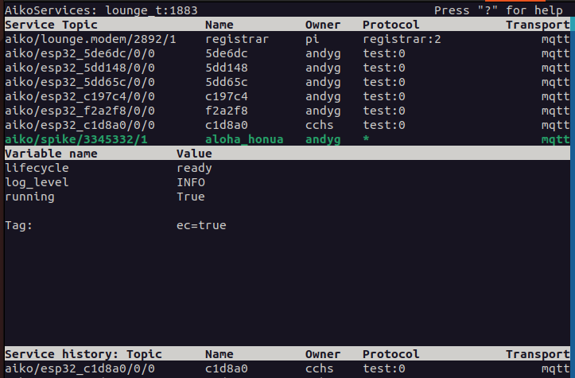

# Aiko Services examples: AlohaHonua (Hello World)

These examples require the Aiko Services [framework](https://en.wikipedia.org/wiki/Software_framework) to be installed and the Core [Services](https://en.wikipedia.org/wiki/Service-oriented_architecture) to be started.

* Installing Aiko Services framework *[TBC]*
* Starting and stopping Core Services *[TBC]*
* Using Aiko Dashboard for monitoring and control *[TBC]*
* More AlohaHonua examples *[TBC]*

The Aiko Services framework relies on (at least) these two Core Services ...

* [MQTT server](https://en.wikipedia.org/wiki/MQTT#MQTT_broker) for transmitting messages between Services (Actors)
* Aiko Registrar for discovering which Services (Actors) are available

Other Services (Actors), like AlohaHonua and the Aiko Dashboard can then
publish messages via the [MQTT](https://mqtt.org) protocol to communicate
with each other.

## The simplest Actor: aloha\_honua\_0.py

In computer science, it is traditional to start with an example [hello world program](https://en.wikipedia.org/wiki/%22Hello,_World!%22_program).  For a given programming language, that example program may be just a single line of code or a few lines of code.  The simpliest Aiko Services equivalent is currently around 11 lines of code.  Clearly, there is a more going on here than just printing "Hello World !".

The AlohaHonua [Actor](https://en.wikipedia.org/wiki/Actor_model) below is a distributed Service that can be discovered, [subscribe and publish messages](https://en.wikipedia.org/wiki/Actor_model#Fundamental_concepts), perform distributed logging and be monitored via the Aiko Dashboard.  Subsequent examples will extend this basic building block to do much more.

*Source code: [aloha\_honua\_0.py](aloha_honua_0.py)*

    from aiko_services.main import *

    class AlohaHonua(Actor):
        def __init__(self, context):
            context.get_implementation("Actor").__init__(self, context)
            print(f"MQTT topic: {self.topic_in}")

        def aloha(self, name):
            self.logger.info(f"AlohaHonua {name} !")

    if __name__ == "__main__":
        init_args = actor_args("aloha_honua")
        aloha_honua = compose_instance(AlohaHonua, init_args)
        aiko.process.run()

[### Running the AlohaHonua Actor with a local MQTT server](#run-local-server)

After the Aiko Services framework has been installed, you'll need to start the Core Services, which are the [mosquitto](https://mosquitto.org) ([MQTT server](https://en.wikipedia.org/wiki/MQTT#MQTT_broker)) and the Aiko Registrar on your computer.  The Aiko Dashboard will also be started, which provides interactive monitoring and control.

    # Current working directory should be the top-level of the Aiko Services repository
    # The first command starts mosquitto, Aiko Registrar and Aiko Dashboard
    ./scripts/system_start.sh
        Starting: /usr/sbin/mosquitto
        Starting: aiko_registrar

    # Use another terminal session, also starting at the top-level of the repository
    cd examples/aloha_honua
    ./aloha_honua_0.py
        MQTT topic: aiko/nomad.local/123/1/in

Whilst the AlohaHonua Actor is running, the Aiko Dashboard will show a list of the available Services / Actors and selecting `aloha_honua` will show further details ...

* AIKO DASHBOARD LOG PAGE *[TBC]*
* MQTT PUBLISH *[TBC]*
* SCREEN SNAPSHOT OF THE LOG MESSAGE "aiko_dashboard_0b.png" *[TBC]*

### Running the AlohaHonua Actor with a remote MQTT server

*[TBC]*

### Stopping the AlohaHonua Actor and Core Services

The AlohaHonua Actor example, Core Services and Aiko Dashboard can be stopped, as follows ...

    # Type Control-C to stop the ./aloha_honua_0.py program

    # Select the terminal session running the Aiko Dashboard and press the "x" key

    # Then stop the Core Services
    ../../scripts/system_stop.sh
        Stopping: aiko_registrar
        Stopping: /usr/sbin/mosquitto

### Examining the AlohaHonua Actor source code

*Source code: [aloha\_honua\_0.py](aloha_honua_0.py)*

Start by importing the Aiko Services [module](https://www.w3schools.com/python/python_modules.asp) for the AlohaHonua Actor.

    from aiko_services.main import *

The AlohaHonua class is defined as a Python class that inherits from the Aiko Services' Actor class.  The class constructor method `__init__()` is required, but don't worry about its implementation for the moment.  The `print()` statement shows the automagically generated MQTT topic path for communicating with this Actor instance and a target for publishing MQTT messages.

    class AlohaHonua(Actor):
        def __init__(self, context):
            context.get_implementation("Actor").__init__(self, context)
            print(f"MQTT topic: {self.topic_in}")

One of the features that the Actor `__init__()` function provides is a [logger](https://en.wikipedia.org/wiki/Logging_(computing)) [instance](https://en.wikipedia.org/wiki/Instance_(computer_science)#Object-oriented_programming) for this Actor

The `self.logger` instance is specific to each Actor, so that log records can be shown for just that Actor.  The logging level can be independently changed on-the-fly by the Aiko Dashboard or given an initial value via the command line ...

`AIKO_LOG_LEVEL=DEBUG ./aloha_honua_0.py`

By default, the `_LOGGER` instance will use distributed logging (via MQTT) that makes it easier to diagnose background or remote Actors via the Aiko Dashboard.  Alternatively, the log records can be sent directly to the terminal console ...

`AIKO_LOG_MQTT=all   ./aloha_honua_0.py  # Default log to both MQTT and console`
`AIKO_LOG_MQTT=true  ./aloha_honua_0.py  # Log only to MQTT`
`AIKO_LOG_MQTT=false ./aloha_honua_0.py  # Log only to the terminal console`

Actors can define functions that can be invoked directly by other Actors (via MQTT messages).

        def aloha(self, name):
            self.logger.info(f"AlohaHonua {name} !")

When coding in Python, Aiko Actors can be discovered and their functions invoked via a regular Python function call.  For testing and diagnosis, MQTT CLI tools can also used to *publish* hand-crafted messages and *subscribe* to observe the output from one or more Actors.

The standard Python `__main__` code defines the AlohaHonua class constructor method` __init__()` arguments, e.g the Actor `name`.  Then creates (*composes*) the AlohaHonua Actor instance.  Finally, the Aiko Process main event loop can be run (which is a blocking call).

    if __name__ == "__main__":
        init_args = actor_args(ACTOR_NAME)
        aloha_honua = compose_instance(AlohaHonua, init_args)
        aiko.process.run()

The Aiko Services framework uses the [Inversion of Control (IoC)](https://en.wikipedia.org/wiki/Inversion_of_control) design pattern, which enables an extensible, event-driven programming model.

The Aiko Services framework also utilizes [Design by Composition](https://en.wikipedia.org/wiki/Composition_over_inheritance) and [Interfaces](https://en.wikipedia.org/wiki/Interface_(object-oriented_programming)), which promotes code reuse ([DRY](https://en.wikipedia.org/wiki/Don%27t_repeat_yourself)) and enables [Aspect Oriented Programming (AOP)](https://en.wikipedia.org/wiki/Aspect-oriented_programming) to deal with cross-cutting concerns.

*Note: About 3 lines of code above are [boilerplate](https://en.wikipedia.org/wiki/Boilerplate_code), i.e the `__init__()` method.  Over time, the aim is to eliminate as much boilerplate code as possible.*
